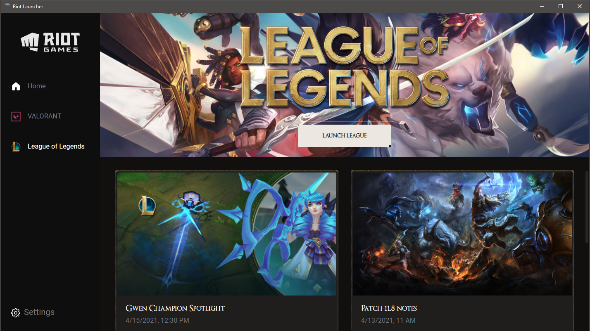

# Riot Launcher
**DISCLAIMER: This is an unofficial launcher for games made by Riot Games.**

⚠️ Tested only on Windows, don't expect it to work on other OSs ⚠️

## Screenshots

## TODO
- Use the Riot video for Valorant https://playvalorant.com/assets/video/Retake-hero-desktop.mp4
- Add update system for the games

## Credits
[VALORANT Font](https://www.reddit.com/r/VALORANT/comments/g0747t/valorant_font/)\
[Original Concept](https://dribbble.com/shots/9369993-Riot-Games-Game-Launcher-UI-UX-Design)\
[VALORANT Button Concept](https://codepen.io/ryne/pen/PoPoqgO)\
[Hover Button](https://codepen.io/GRA0007/pen/zYxGrxd)\
[Icons](https://primer.style/octicons/)
