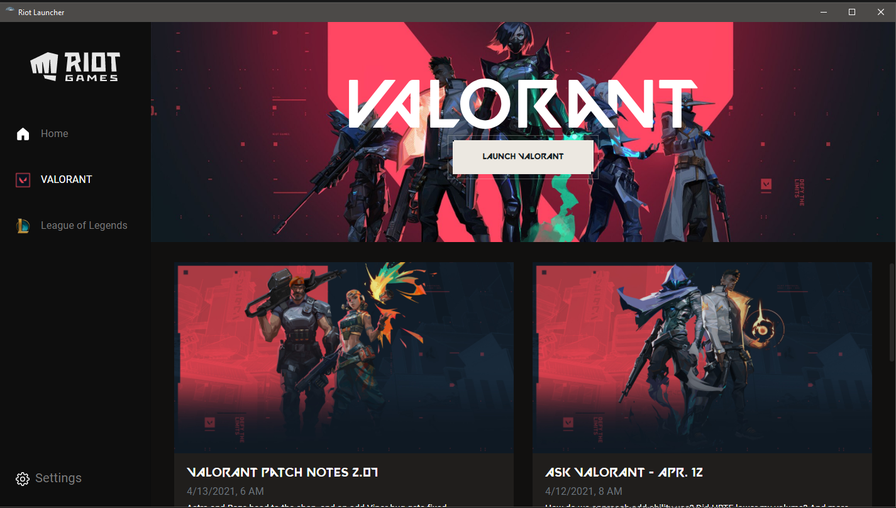

# Riot Launcher
> I have only tested this on Windows, so don't expect it to work on other operating systems.
This is an unofficial, work in progress launcher for games made by Riot Games.

## Screen Shots

## TODO

- Check if game is installed
- Use the Riot video for Valorant https://playvalorant.com/assets/video/Retake-hero-desktop.mp4
- Add icons next to the game's names in the side bar
- Add update system for launcher
- Add update system for the games

## Credits

VALORANT Font - https://www.reddit.com/r/VALORANT/comments/g0747t/valorant_font/

Riot Games Launcher Design Idea - https://dribbble.com/shots/9369993-Riot-Games-Game-Launcher-UI-UX-Design

Play VALORANT Button Idea - https://codepen.io/ryne/pen/PoPoqgO

Hover Button - https://codepen.io/GRA0007/pen/zYxGrxd

Icons - https://primer.style/octicons/
